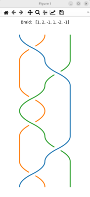

# BraidPy

A Python library for working with braids, with the goal to help design real world complex 3D braids, using recent
advances in braid theory. Sources are shared on [github](https://github.com/baptistelabat/braidpy)

## Features

- [x] Mathematical representation of braids with braid words using Artin's generators
- [x] Conversion between different braid word formats
- [x] Braid operations and manipulations (inversion, handles reduction, ...)
- [x] Generation of parametric braid from braid word
- [x] Visualization capabilities (ASCI, 2D and 3D) 
- [x] Computations of mathematical properties of braid word or invariants of braid
- [ ] Annulus braids
- [ ] Conversion from parametric braid to braid word
- [ ] Conversion from material braid to parametric braid
- [ ] Kumihimo braid with Mobidai
- [ ] Simulation of machine braiding process (hexagonal 3D rotary braiding machine)

## Basic example

```python
from braidpy import Braid

# Create a braid using list of Artin's generator
b = Braid([1, 2, -1])

# Display the corresponding braid word. You should get the notation as used by Artin 'σ₁σ₂σ₁⁻¹'.
b.format()

# Display using other common notation. You should get 'abA'.
b.format_to_notation(target='alpha')

# Draw the braid in console. Alternatively use result.plot() for more advanced 2D plot.
b.draw()

# Perform operations. See documentation for much more features !
result = b * b.inverse()

# Draw the resulting braid in console.
result.draw()

# Plot the resulting braid.
result.plot()

# Convert to parametric braid before ploting in 3D.
strands = result.to_parametric_strands()
from braidpy.parametric_braid import (
    ParametricBraid,
)
p = ParametricBraid(strands)  # .plot()
p.plot()
```

The plot should give the following:


## 🛠️ Installation
Release versions are available on Pypi and it should be very easy to install braidpy in your python environment.

Using pip
```bash
pip install braidpy
```

Or using poetry
```bash
poetry add braidpy
```

Or using uv (recommended package manager used on the project)
```bash
uv add braidpy
```
## 🛠️ Installation from source
The version in pypi might lack features or bug corrections compared to the development versions.

You can download the code directly from GitHub or using git:

```bash
git clone git@github.com:baptistelabat/braidpy.git
```
By default, you should be on the 'develop' branch.

To install the required dependencies, follow the steps below:

2. On linux, run the commands from root of repository to install uv. Use the official [installation guide](https://docs.astral.sh/uv/getting-started/installation) otherwise.
   ```bash
   sudo apt-get install build-essential
   cd braidpy
   make install-uv
   ```
---

## Test
To launch the complete suite of tests, launch the following command:
```bash
uv run pytest tests
```
Alternatively, if you have make install, just run:
   ```bash
   make test
   ```


---

## 📜 Documentation
Documentation of released versions is hosted by [readthedocs](https://braidpy.readthedocs.io/en/latest/)

Documentation of development version can be found on [github pages](https://baptistelabat.github.io/braidpy)
You should be able to select among several versions. Note that the process of generation is manual, so documentation
might not be up to date
You can also generate the documentation for your version installed from sources
   ```bash
   make docs
   ```

### Project Team:
This is a single person project for now, but I would be happy to make the team grow.

Human: 
- **Baptiste Labat**
[](https://www.linkedin.com/in/baptiste-labat-01751138/)
[](https://github.com/baptistelabat)

Bots:
- chatgpt
- windsurf
---

## 🤝 Contributions

Contributions are welcome! Please open an [issue](https://github.com/baptistelabat/braidpy/issues) or submit a pull request from your fork to suggest changes, report/correct bugs, or propose new features.

Here are a few code guidelines:  
- We use english for code and comments.
- We use Google style docstring.
- We use type hinting.  
Please be sure to install the pre-commit tool in order to check your code while commiting in order to keep a clean project history.
```bash
pre-commit install
```
Please have a look to makefile to find helpful commands.

## 📜 License


This project is licensed under the Mozilla Public License 2.0 - see the [LICENSE](./LICENSE) file for details.

---