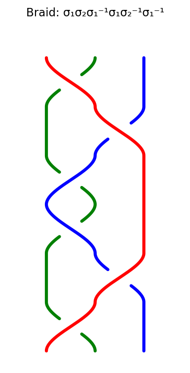

# BraidPy

A Python library for working with braids, with the goal to help design real world complex 3D braids, using recent
advances in braid theory. Sources are shared on [github](https://github.com/baptistelabat/braidpy)

## Features

- [x] Mathematical representation of braids with braid words using Artin's generators
- [x] Conversion between different braid word formats
- [x] Braid operations and manipulations (inversion, handles reduction, ...)
- [x] Generation of parametric braid from braid word
- [x] Visualization capabilities (ASCI, 2D and 3D) 
- [x] Computations of mathematical properties of braid word or invariants of braid
- [x] Annulus braids: crossings, the wrapping crossing and turns on a ring of slots
- [x] Closed-form geometry for the shapes that admit one — a laid rope, a
      braided tube, the figure-eight flat braid — with their clearances measured
      rather than assumed
- [x] Simulation of horn gear (maypole) braiding machines: flat, tubular,
      soutache and Jacquard lace, with tracks, collisions and animation
- [x] Conversion from parametric braid to braid word, for flat braids — so a
      computed shape can be checked against the braid it claims to be
- [ ] Conversion from material braid to parametric braid
- [ ] Kumihimo braid with Mobidai (Kumihimo disk or Friendship Wheel)
- [x] Kumihimo and mobidai disks animated from above, strands as spokes to
      the braiding point, moving continuously from step to step
- [ ] Kumihimo braid with Marudai diagram
- [x] A braid as it comes off whatever made it, in 3D — a horn gear machine,
      a braid word, a mobidai or a kumihimo disk: laid with no tension,
      converging on a braiding point or fell circle, and tightened
- [ ] Finger loop braids (Kute-Uchi), a technic used and improved by nuns for centuries
- [ ] Track plan
- [ ] Simulation of 3D rotary (hexagonal) braiding machines

## Basic example

```python
from braidpy import Braid

# Create a braid using list of Artin's generator
b = Braid([1, 2, -1])

# Display the corresponding braid word. You should get the notation as used by Artin 'σ₁σ₂σ₁⁻¹'.
b.format()

# Display using other common notation. You should get 'abA'.
b.format_to_notation(target='alpha')

# Draw the braid in console. Alternatively use result.plot() for more advanced 2D plot.
b.draw()

# Perform operations. See documentation for much more features !
result = b * b.inverse()

# Draw the resulting braid in console.
result.draw()

# Plot the resulting braid.
result.plot()

# Convert to parametric braid before ploting in 3D.
strands = result.to_parametric_strands()
from braidpy.parametric_braid import (
    ParametricBraid,
)
p = ParametricBraid(strands)  # .plot()
p.plot()
```

`result.plot()` gives the 2D diagram below — the braid runs down the page with its
word above it, each strand in the same colour the console draws it in, and the strand
passing behind interrupted where the two meet. `p.plot()` opens the 3D view.



## Braiding machines

A horn gear (maypole) braiding machine can be described, run and drawn. Half
its carriers travel one way round the ring of gears and half the other, and the
closed paths they run on decide which carriers can ever meet — which is what
decides the braid.

```python
from braidpy.horn_gear.examples import tubular_braid_8
from braidpy.horn_gear.tracks import compute_tracks, simulation_period
from braidpy.horn_gear.loading import load_carriers
from braidpy.horn_gear.simulation import simulate

machine = tubular_braid_8()
len(compute_tracks(machine))      # 4 closed tracks
simulation_period(machine)        # 8 steps to come home

history = simulate(machine, simulation_period(machine), load_carriers(machine))
```

Threading is a search, not a convention: `load_carriers` tries placements,
runs each one, and keeps the fullest that never collides. `visualize_machine`
and `animate` draw the result, and `gen_demos.py` writes a page per machine —
flat, tubular, soutache, diamond, and a Jacquard lace machine whose gears
interpenetrate and whose switches are driven by a punched programme.

## The shape a braid takes

Pulled tight, some braids have a shape you can write down. A laid rope does; so
does a braided tube; so does the classic flat braid. Most do not, and the
reason is not want of effort.

```python
import math
from braidpy.annulus_braid import lay_radius, packing_radius, tubular_braid_radius

packing_radius(3, 0.4)                          # 0.231 — the zero-lay limit
lay_radius(3, 0.4, lay=2.0)                     # 0.259 — where it really settles
tubular_braid_radius(8, 0.4, math.radians(45))  # 0.825 — in closed form
```

The documentation works each of these through, with figures generated from the
same functions:

- [The shape of a laid rope](https://github.com/baptistelabat/braidpy/blob/develop/docs/source/laid_rope.md)
- [The shape of a braided tube](https://github.com/baptistelabat/braidpy/blob/develop/docs/source/braided_tube.md)
- [Why a braid's shape has no closed form](https://github.com/baptistelabat/braidpy/blob/develop/docs/source/why_no_closed_form.md)
- [Solving a braid's shape numerically](https://github.com/baptistelabat/braidpy/blob/develop/docs/source/solving_numerically.md)

## 🛠️ Installation
Release versions are available on Pypi and it should be very easy to install braidpy in your python environment.

Using pip
```bash
pip install braidpy
```

Or using poetry
```bash
poetry add braidpy
```

Or using uv (recommended package manager used on the project)
```bash
uv add braidpy
```
## 🛠️ Installation from source
The version in pypi might lack features or bug corrections compared to the development versions.

You can download the code directly from GitHub or using git:

```bash
git clone git@github.com:baptistelabat/braidpy.git
```
By default, you should be on the 'develop' branch.

To install the required dependencies, follow the steps below:

2. On linux, run the commands from root of repository to install uv. Use the official [installation guide](https://docs.astral.sh/uv/getting-started/installation) otherwise.
   ```bash
   sudo apt-get install build-essential
   cd braidpy
   make install-uv
   ```
---

## Test
To launch the complete suite of tests, launch the following command:
```bash
uv run pytest tests
```
Alternatively, if you have make install, just run:
   ```bash
   make test
   ```


---

## 📜 Documentation
Documentation of released versions is hosted by [readthedocs](https://braidpy.readthedocs.io/en/latest/)

Documentation of development version can be found on [github pages](https://baptistelabat.github.io/braidpy)
You should be able to select among several versions. Note that the process of generation is manual, so documentation
might not be up to date
You can also generate the documentation for your version installed from sources
   ```bash
   make docs
   ```

### Project Team:
This is a single person project for now, but I would be happy to make the team grow.

Human: 
- **Baptiste Labat**
[](https://www.linkedin.com/in/baptiste-labat-01751138/)
[](https://github.com/baptistelabat)

Bots:
- chatgpt
- windsurf
---

## 🤝 Contributions

Contributions are welcome! Please open an [issue](https://github.com/baptistelabat/braidpy/issues) or submit a pull request from your fork to suggest changes, report/correct bugs, or propose new features.

Here are a few code guidelines:  
- We use english for code and comments.
- We use Google style docstring.
- We use type hinting.  
Please be sure to install the pre-commit tool in order to check your code while commiting in order to keep a clean project history.
```bash
pre-commit install
```
Please have a look to makefile to find helpful commands.

## 📜 License


This project is licensed under the Mozilla Public License 2.0 - see the [LICENSE](https://github.com/baptistelabat/braidpy/blob/HEAD/LICENSE) file for details.

---