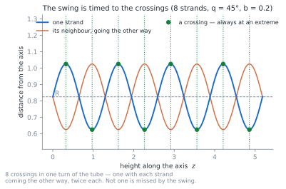
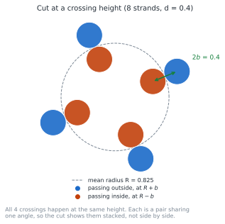
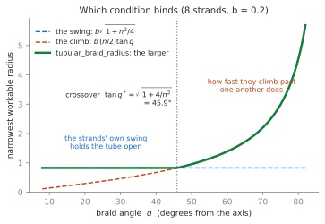
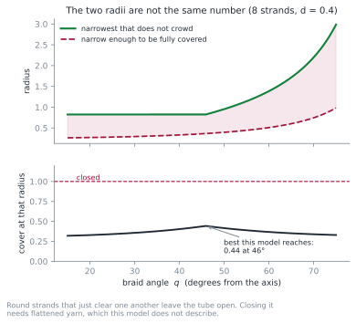

# The shape of a braided tube

A braided tube — a sleeve, a shoelace, a cable sheath — is half its strands
spiralling one way round a tube and half the other, interlacing where they
meet. This page explains the curve braidpy uses for it, the two things the
published formula leaves unsaid, and where the tube's radius comes from.

Everything here lives in {py:mod}`braidpy.annulus_braid`.

## The curve

The model is Brunnschweiler's, from page 19 of
[The geometry of tubular braided structures](https://scispace.com/pdf/the-geometry-of-tubular-braided-structures-32b4yiwio2.pdf).

A strand winds round the tube at a constant angle to the axis while its
distance from the axis swings in and out — out where it passes over a strand
coming the other way, in where it passes under:

```{math}
r(\theta) = R \pm b\,\sin\!\left(\frac{n\theta}{2}\right),
\qquad
z = R\,\theta\cot q
```

with $R$ the mean radius, $b$ the swing, $n$ the strand count and $q$ the
braid angle, measured from the axis. Setting $b = 0$ leaves plain helices that
would have to pass through one another; the swing is the whole of the braid.

Note that $q$ belongs to the **mean** helix. The swing makes the local angle
wander either side of it, and biases it upward, since swinging out and in adds
path across the tube but none along it.

## Two things the formula does not say

Written as above, the model is a single strand. Placing $n$ of them takes two
further decisions, and both are load-bearing —
{py:func}`~braidpy.annulus_braid.tubular_braid` makes them for you.

**The strands alternate direction round the tube.** Spaced evenly and
alternating, two that cross meet where the radial swing is at its extreme, so
one is fully out and the other fully in. Space them any other way and they
meet mid-swing, or — in the worst case — where the swing is zero and they are
in the same place.

**The swing follows the direction.** A strand going one way must bulge out
where one going the other way tucks in. Give them a common sign and both
strands of a crossing take the same radius, which is a collision rather than
a braid.

Get both right and the timing is exact, not approximate:



Eight strands, so one strand has eight crossings in a single turn of the tube
— one with each of the four strands coming the other way, twice each — and
every one of them lands on a peak or a trough. Not one is missed.

## At a crossing

Cut across the tube at a crossing height and you see what the swing buys:



Two things worth noticing. The crossing pair is $2b$ apart radially, so a
swing of half a diameter sets them exactly touching — which is why
{py:func}`~braidpy.annulus_braid.tubular_braid` defaults $b$ to $d/2$. And all
four crossings happen at the *same* height: each is a pair sharing one angle,
so the cut shows them stacked radially, not spread round the circle.

## Where the radius comes from

Nothing so far says how wide the tube must be. That comes from asking when the
crossing is the tightest spot — because if the strands are closer somewhere
else, the design is decided somewhere you were not looking.

Take the two strands of a crossing and let $s$ and $t$ measure how far each has
gone past it. At the crossing the swing holds them $2b$ apart. Just beside it
the swing has decayed as $\cos(ns/2)$ — so by $b n^2 s^2/8$ to second order —
while the angle between them has opened by $s + t$ and their heights have
parted by $R\cot q\,(s-t)$. Writing $p = s + t$ and $m = s - t$:

```{math}
D^{2} \simeq 4b^{2}
    + p^{2}\left[(R^{2} - b^{2}) - \tfrac{1}{4}b^{2}n^{2}\right]
    + m^{2}\left[R^{2}\cot^{2}q - \tfrac{1}{4}b^{2}n^{2}\right]
```

There is no cross term — the two motions are independent — so the crossing is
the tightest spot exactly when both brackets are non-negative. Each bracket
gives a condition on $R$, and both must hold:

```{math}
R = b \max\!\left(\sqrt{1 + \tfrac{n^{2}}{4}},\;
    \tfrac{n}{2}\tan q\right)
```

which is {py:func}`~braidpy.annulus_braid.tubular_braid_radius`, in closed
form, from the geometry rather than by squeezing and measuring.

## Which condition binds

The $\max$ is not a technicality. The two terms are two different physical
things holding the tube open, and which one wins tells you what is actually
setting the diameter:



- Below the crossover, the **strands' own swing** holds it open. The radius
  does not depend on the braid angle at all — the flat stretch on the left.
- Above it, **how fast they climb past one another** does, and the radius runs
  away as the strands turn towards the circumference.

The crossover sits at

```{math}
\tan q^{*} = \sqrt{1 + 4/n^{2}}
```

which tends to 45° as strands are added, so any braid of more than a few
strands changes character near 45°.
Some worked values, for strands 0.4 thick — "seated at" is
{py:func}`~braidpy.annulus_braid.packing_radius`, the strands merely side by
side with no braid at all:

| strands | braid angle | seated at | narrowest radius | once round in |
| --- | --- | --- | --- | --- |
| 4 | 45° | 0.283 | 0.447 | 2.81 |
| 8 | 45° | 0.523 | 0.825 | 5.18 |
| 16 | 45° | 1.025 | 1.612 | 10.13 |
| 8 | 65° | 0.523 | 1.716 | 5.03 |

{py:func}`~braidpy.annulus_braid.crossing_binds_above` answers the question
directly:

```python
from braidpy.annulus_braid import crossing_binds_above, tubular_braid_radius
import math

crossing_binds_above(8, math.radians(40))   # False — swing-bound
crossing_binds_above(8, math.radians(50))   # True  — climb-bound
tubular_braid_radius(8, 0.4, math.radians(45))   # 0.825
```

## Why this one has a formula and the rope does not

The derivation worked because a crossing is a point of symmetry for **both**
strands. That makes it automatically a critical point of the distance between
them, so the first-order terms vanish and only the second-order ones matter —
and those are quadratic in $p$ and $m$, which is algebra.

[A laid rope](laid_rope.md) has no such point. Its strands never cross, their
nearest approach is not at any symmetric position, and where it falls moves
with the lay — so {py:func}`~braidpy.annulus_braid.lay_radius` has to search.
The general argument is in
[Why a braid's shape has no closed form](why_no_closed_form.md).

## What the model will not give you

{py:func}`~braidpy.annulus_braid.cover_factor` measures tightness the way a
braider does — the fraction of the tube's surface the strands hide. Half the
strands run each way, so one direction covers the surface when its $n/2$
strands, each crossing a circumferential cut in a segment of $d/\cos q$,
together span the circumference:

```{math}
\text{cover} = \frac{n}{2}\,\frac{d / \cos q}{2 \pi R}
```

And here is the model's main limitation. The radius that avoids crowding and
the radius that looks like a braid are not the same number:



At the narrowest radius the strands will tolerate, an eight-strand tube covers
less than half its surface at every braid angle. Round strands that just clear
one another leave the tube visibly open. Real sleeving closes because its yarn
flattens where it crosses, letting the strands occupy less radial room than
their nominal diameter — which this model does not describe.

So treat {py:func}`~braidpy.annulus_braid.radius_for_cover` as what you want
and {py:func}`~braidpy.annulus_braid.tubular_braid_radius` as what round
strands allow, and read the gap between them as how much the yarn would have
to give.

## See also

- [The shape of a laid rope](laid_rope.md) — the same questions without
  crossings.
- {py:func}`~braidpy.annulus_braid.tubular_braid_clearance` measures a built
  tube's actual clearance, which is how the formula above is checked.
- The figures on this page are drawn by `gen_docs_figures.py`, which computes
  them with the functions it documents.
