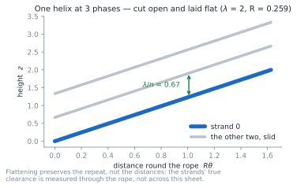
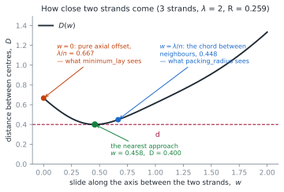
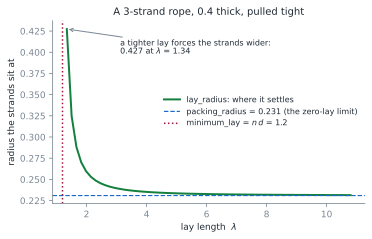

# The shape of a laid rope

A rope is the one braid in braidpy whose shape can be written down. This page
says what the shape is, where each formula comes from, and — since it matters
for reading the code — which of them is exact and which is a search.

Everything here lives in {py:mod}`braidpy.annulus_braid`.

## A rope has no crossings

On a ring of slots there are two kinds of move. A **crossing** puts two
neighbouring strands past each other, one passing outside the other. A
**turn** carries every strand round one slot together — nobody passes anybody.

Laying up a rope is turns, and only turns:

```python
from braidpy.annulus_braid import rope, tubular_paths

paths = tubular_paths(rope(3), 3)
assert all(sign == 0 for path in paths for sign in path.signs)
```

Every sign is zero: no strand is outside or inside any other at any step. That
is what separates a rope from a braid, and it is the reason a rope has a shape
anyone can write down. The strands never have to get past one another, so
their shape is a one-parameter family — helices of radius $R$ — and symmetry
says where they touch without anyone having to search a surface for it.

## The strands are one curve, repeated

In an evenly laid rope, strand $k$ is strand 0 slid along the axis by $k$
n-ths of a lay. The strands are not merely alike; they are the same curve at
$n$ phases.



The picture is the rope's surface cut down one side and laid flat, which is
the view where a helix becomes a straight line and the repeat is obvious. Be
careful reading distances off it: flattening preserves the repeat but not the
clearances, which are measured through the rope rather than across the sheet.

That one fact — one curve, repeated — is what every formula below rests on.

## Nothing holds the strands out

The radius is not something you choose. A helix of smaller radius is shorter,
so tension pulls the strands inward, and what stops them is each other. The
radius is an **output**: the value at which they just touch.

So the question is only ever "how close do two of them come?".

## How close two strands come

Because the strands are one helix repeated, the distance between two of them
depends on a single variable: how far along the axis one is slid relative to
the other. Call that $w$. Then

```{math}
D(w)^2 = 4R^2\sin^2\!\left(\frac{\pi w}{\lambda}\right)
         + \left(\frac{k\lambda}{n} - w\right)^2
```

The first term is the chord across the circle between two points whose angles
differ by $2\pi w/\lambda$; the second is what remains of the axial offset
after sliding by $w$. Their clearance is this minimised over $w$ — one
variable, no surface to search. {py:func}`~braidpy.annulus_braid.helix_clearance`
scans it and then refines by golden section.



Two points on that curve have names, and the figure's point is that **neither
of them is the answer**:

| Where | What it is | Which function sees it |
| --- | --- | --- |
| $w = k\lambda/n$ | the chord between neighbours at equal height | {py:func}`~braidpy.annulus_braid.packing_radius` |
| $w = 0$ | the pure axial offset $\lambda/n$ | {py:func}`~braidpy.annulus_braid.minimum_lay` |
| in between | the actual nearest approach | {py:func}`~braidpy.annulus_braid.lay_radius` |

A strand's nearest neighbour is not alongside it. It is a little further along
the neighbour's *other* turn.

## The two bounds

{py:func}`~braidpy.annulus_braid.packing_radius` is the familiar
cross-section answer, $R = d / (2\sin(\pi/n))$: evenly spaced round a circle,
neighbours touch when the chord between them is one diameter. It is exact —
for strands that run straight. Give the rope any lay at all and the strands
come closer than it says, because winding brings a strand nearer to its
neighbour's other turns. At the tightest lay they can be made at,
three strands at the packing radius clear 0.76 of a diameter, and the
shortfall barely eases with more strands — 0.71 at twelve.

{py:func}`~braidpy.annulus_braid.minimum_lay` is the other bound,

```{math}
\lambda \ge n\,d
```

and it follows directly from the repeat. Take a point on one strand and the
matching point on another: they are at the same place across the rope and
differ only by $\lambda/n$ of height. Widening the rope does not separate
them, because they are the same point of the same curve. Below $n d$ no radius
keeps the strands apart and the rope cannot be made.

Note what that argument needs: the evenness, not ropes in general. A rope
whose strands differ from one another is outside it. The bound is also not
attained — clearing a diameter *at* it would take an infinite radius — and it
is rarely what bites first. Crowding round the circle usually does. Its use is
that it is cheap and exact.

## Where the rope settles

{py:func}`~braidpy.annulus_braid.lay_radius` puts the two together. The
clearance rises with the radius, so bisection finds where it equals a
diameter, bracketed below by the packing radius.



The curve is the whole story: at a long lay the rope approaches the packing
radius from above, and as the lay tightens towards $n d$ the radius runs away
to infinity. A tighter rope is a fatter one.

```python
from braidpy.annulus_braid import lay_radius, packing_radius

packing_radius(3, 0.4)         # 0.231 — the zero-lay limit
lay_radius(3, 0.4, lay=2.0)    # 0.259 — where it actually settles
lay_radius(3, 0.4, lay=1.34)   # 0.432 — a tight lay, much fatter
```

## Why this one is a search

It is worth being explicit, because the braided tube next door *does* have a
closed form. The difference is where the nearest approach sits.

A crossing of a braided tube is a point of symmetry for **both** strands, so
it is automatically a critical point of the distance between them, and only
the second-order behaviour around it matters — which is algebra. Two helices
of a rope have no such point. Their nearest approach is not where the chord
between them is, as the $D(w)$ figure shows, and its location moves with the
lay. There is nothing to expand around.

Concretely, the minimum of $D(w)$ is where its derivative vanishes, which for
neighbouring strands reads

```{math}
\frac{4\pi R^{2}}{\lambda}\sin\!\left(\frac{2\pi w}{\lambda}\right)
    = 2\left(\frac{\lambda}{n} - w\right)
```

— a transcendental equation, with $w$ inside a sine on one side and linear on
the other. It has no closed-form root, which is why
{py:func}`~braidpy.annulus_braid.lay_radius` bisects.

So {py:func}`~braidpy.annulus_braid.lay_radius` bisects. The problem is
well-posed and the answer is exact to tolerance; it simply is not a formula.
The general version of this argument is in
[Why a braid's shape has no closed form](why_no_closed_form.md).

## See also

- [The shape of a braided tube](braided_tube.md) — the same questions where
  there *are* crossings, and where the radius does come out in closed form.
- {py:func}`~braidpy.annulus_braid.rope_helices` builds the curves themselves.
- {py:func}`~braidpy.parametric_braid.closest_approach` measures the clearance
  of any set of strands numerically, which is how the formulas above are
  checked in the tests.
