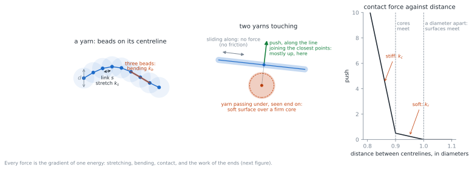
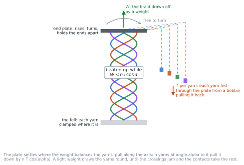
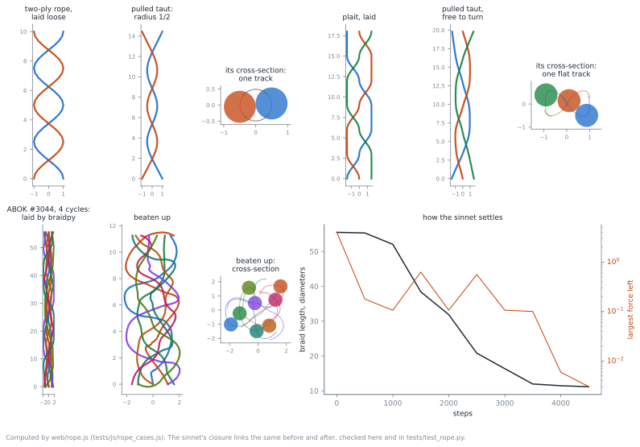

# Settling a braid by physics

Braid Studio can tighten a braid two ways. **Sideways** (`web/tighten.js`,
the JavaScript twin of `braidpy.take_off.tighten_yarns`) moves each sample of
each yarn sideways only, so every sample keeps the height it was laid at: the
braid keeps the pitch it was laid with, and a braid laid loose stays loose —
and round, whatever its pattern. A real braid is not made so. Each new crossing
is beaten up against the ones before, until the crossings jam; the pitch, and
the shape of the cross-section — round, square, triangular — are what jamming
leaves.

**By physics** (`web/rope.js`, in beta, for disk braids) lets the braid find
that state itself. This page explains how, and what it does and does not do
yet.

## The model

Each yarn is a chain of beads on its centreline, half a diameter apart. Its
energy is the sum of

| term | per | energy | in the page |
|---|---|---|---|
| stretching | link | $\tfrac{k_s}{2}\,(\lvert x_{i+1}-x_i\rvert - s)^2$ | $k_s = 100$: yarn stretches 1 % under its tension |
| bending | bead | $\tfrac{k_b}{2}\,\lvert x_{i-1}-2x_i+x_{i+1}\rvert^2/s^2$ | $k_b = 0.5$: slight |
| contact, surfaces | pair of segments | $\tfrac{k_r}{2}\,(d - r)^2$ when $r < d$ | $k_r = 5$ |
| contact, cores | pair of segments | $\tfrac{k_c}{2}\,(d - w - r)^2$ when $r < d - w$ | $k_c = 100$, $w = 0.1\,d$ |

where $r$ is the distance between the closest points of two segments, of two
different yarns or of one yarn far apart along it. A yarn is a firm core in a
soft surface: two yarns feel each other coming, meet gently, and touch at about
a diameter. Lengths are in yarn diameters, $d = 1$.

### Forces between yarns, and the vertical

The contact force between two segments acts along the line joining their
closest points, in three dimensions. Where one yarn passes over another — at a
crossing — that line is mostly vertical, so the push between them is mostly
vertical: this is what carries the beating from crossing to crossing down the
braid, and what jams them. Where two yarns lie side by side, the line is
horizontal, and the push packs the cross-section.

There is no force along the yarns' surfaces: **no friction**. Yarns slide
freely along each other, and along themselves through the crossings (see
*feeding*, below). That is the simplest model that has a single energy; what
friction would add is discussed under *Friction*, below.

### The ends

- **The fell.** Each yarn's newest end is clamped where it was laid.
- **The end plate.** Each yarn's oldest end is fixed to a plate. The plate
  rises or sinks, and may turn about the axis, but never lets the ends move
  with respect to one another: nothing can come unbraided at the end. A force
  $W$ draws it up: the weight the braid is drawn off with.
- **Feeding.** Each yarn slides through its place on the plate, from a bobbin
  pulling it back with a tension $T$, as a braid's yarns come from their
  carriers. The yarn inside the braid then costs $T$ per unit length, and how
  much of it there is becomes an unknown too: each yarn's link rest length $s$.
  When the links grow too long or too short, the yarn is laid out again with
  new beads.

With $n$ yarns at an angle $\alpha$ to the axis, the yarns pull the plate down
by $n\,T\cos\alpha$. While the weight is lighter, the plate sinks, drawing the
yarns round, until the crossings jam and the contacts take the rest. The page
uses $T = 1$ and $W = n/4$: braids beaten up hard.

### The solver

The minimum of the total energy, including the work of the weight and of the
bobbins, is the braid at rest. It is found by **FIRE** (Bitzek et al., *Phys.
Rev. Lett.* 97, 170201, 2006): damped dynamics that speed up while going
downhill and stop dead when going up. Every force is the gradient of the one
energy, so at rest they balance. Each step:

1. Rebuild the list of segment pairs near enough to touch, if any bead has
   moved a quarter diameter since it was built.
2. Compute the forces: stretching, bending, contact, on each bead; on the
   plate, the weight and the pull of the yarns' last links; on each yarn's
   rest length, its tension against its bobbin's.
3. FIRE: turn the velocities towards the forces; if the power (force times
   velocity) is negative, stop everything, halve the time step, and start
   again from rest; if it has been positive for a while, lengthen the step.
4. Move every bead, no bead more than a tenth of a diameter in one step, so no
   yarn can pass through another between two checks.
5. Lay a yarn out again with new beads if its links have grown too long or too
   short.

It stops when no force is larger than $10^{-3}$.

### Getting there

The laid yarns are first pulled clear of each other sideways (100 steps of
`tighten.js`, or more if asked): laid as braidpy lays them, two crossing yarns
may pass through the same point, and an overlap left for the physics to push
apart could part the wrong way.

## What it gives, and how it is checked

`tests/test_rope.py` checks the solver against physics:

- **A two-ply rope**, its end held from turning, pulled taut: it closes until
  the yarns touch, a helix of radius half a diameter, and rises as far as the
  yarns' length lets it.
- **The same rope, free to turn**: it untwists, as a frictionless rope must.
- **A plait, free to turn**: it stays the same plait — the braid word read
  back off the settled yarns is the one laid — and barely turns.
- **A sinnet beaten up**: no yarn has passed through another. That is checked
  on the braid's closure, each yarn's top end joined round the outside to the
  bottom end beside it: the **linking numbers** of its loops, computed exactly
  from the yarns as polylines (Klenin and Langowski, *Biopolymers* 54, 307,
  2000), must not change. A yarn passing through a yarn of another loop
  changes their linking number by one, however the yarns fold — and beaten-up
  yarns do fold, so a braid word read off them would not do.

On the page, ABOK #3044 over 4 cycles beats up from 55 to 11 diameters long in
about 7 s.

## Making it crossing by crossing, with friction

Beaten up all at once, under one weight, a long braid takes a long while: the
weight must draw the whole laid length down, and the solver's steps are short.
And friction would only freeze it part way. A braid is not made so: it is
made a crossing at a time, each new one beaten up against the made braid,
and friction holds what is made. `web/form.js` makes it so — the third
**Settle** choice, *made crossing by crossing, with friction, then settled*.

The yarns, as braidpy laid them (their crossings in the order they are made),
are in three parts:

- **made**: below a working window, the braid beaten up so far, frozen;
- **working**: the window, about two rows, where the yarns move, with the
  stretching, bending and contact above, plus friction;
- **to come**: above it, the rest of the braid as laid, moving as one block.
  The yarns' tension draws it down onto the window and a weight draws it up,
  as the end plate above: while the yarns pull harder, the newest row is
  beaten up against the made braid, until its crossings jam.

Each yarn slides into the window from the block at its tension, as from a
bobbin. Once the window is at rest, all but its top two diameters are frozen
into the made braid, and the window takes in the next row from the block.
The block only moves as one, and nothing in the window passes through what
is above or below it, so the braid made is the braid laid: the linking
numbers check it, as above.

**Friction.** Two yarns in contact hold each other along their surfaces with
a spring, from where they first touched, until its pull reaches $\mu$ times
the push between them, when they slip: Coulomb's law, as the discrete element
method has it ($\mu = 0.3$, spring stiffness 20). The springs are kept from
step to step and from row to row: the window remembers. Friction is not the
gradient of any energy, but FIRE needs only forces, so the window is settled
the same way.

**Then settled.** The made braid is a good start, not the end: each row was
beaten against a frozen braid, and the frozen braid keeps whatever twist and
width it was made with. So the whole is settled afterwards by `rope.js`, as
the second **Settle** choice does from the laid braid — which, from this start,
takes a second or two.

| ABOK sinnet | laid | beaten up at once | made crossing by crossing | then settled |
|---|---|---|---|---|
| #3044, 8 strands, 4 cycles | 55.5 long | 11.3, in 4.5 s | 13.1, in 5 s | 11.1, in 1.3 s more |
| #3048, 17 strands, 3 cycles | 204 long | about 10, in 2.5 to 4.5 min | 7.9, in 80 s | 6.1, in 1 s more |

Lengths in yarn diameters; times in Node, a page in a browser takes about the
same. Friction changes little here: #3044 is made 13.1 long with it, 12.6
without.

## Limits, and what is next

- **Speed.** A 17-strand sinnet (ABOK #3048, 3 cycles) is laid 204 diameters
  long, about 7000 beads, and takes minutes to beat up at once: the page's
  progress shows little for a long while, then rises. Made crossing by
  crossing it takes 80 s. The time step is set by the
  stiffest springs; the length to travel, by how long the braid is laid.
  Fewer beads (the made part frozen), a shorter start, or the GPU would help.
- **Shapes.** Cross-sections start to differ — #3044's tracks lean toward a
  triangle — but the yarns are not packed tight yet: gaps remain. Made
  crossing by crossing, the braid keeps the width it was laid with: braidpy
  lays a sinnet's strands round a ring, the first rows freeze at that ring's
  radius, and each later row is beaten against them and pressed by the laid
  braid above, at the same radius. A real braid draws in to the fell, its
  yarns spreading out above it to their carriers: the block above should
  rather be yarns running out to carriers.
- **Which braids.** Disk braids only. Word and machine braids are laid with all
  their yarns meeting at one point at the fell, which cannot be clamped apart;
  they still settle sideways.
- **Tried and dropped.** Laying rows closer, to start shorter, was tried and dropped:
  on rows a diameter apart the sideways clearing can push one yarn past
  another, which the linking numbers caught.
