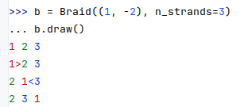
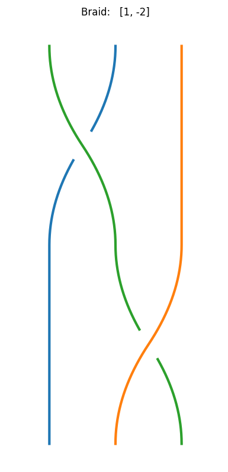
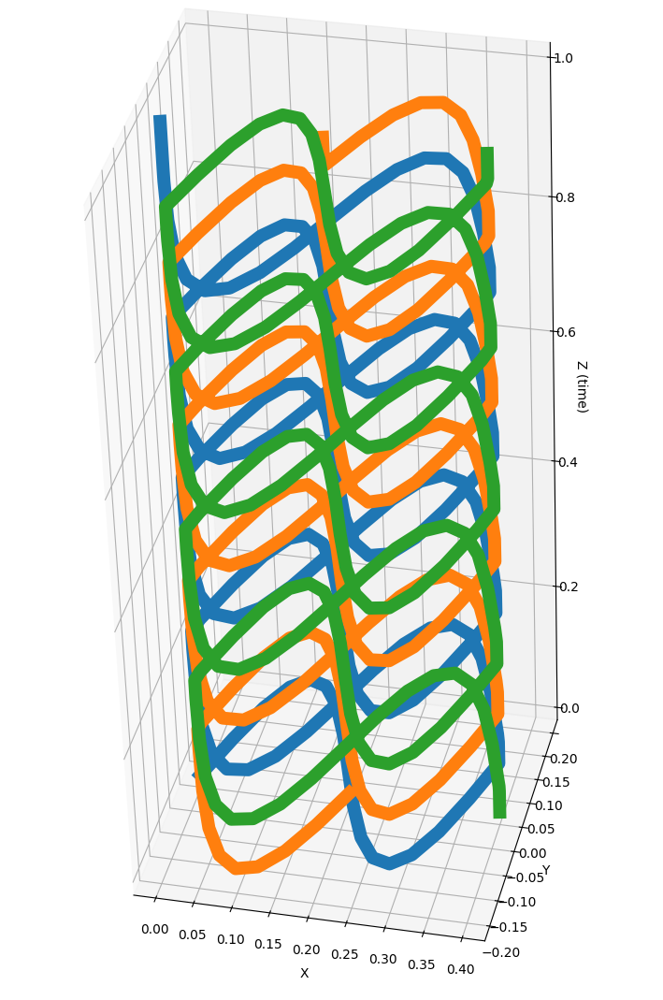

# Visualizing braids

The followign code presents the different visualizations integrated in braidpy:

```python
from braidpy import Braid
from braidpy.parametric_braid import ParametricBraid
import matplotlib

matplotlib.use("QtAgg")
b = Braid((1, -2), n_strands=3)

# Draw in console
b.draw()

# 2D braid diagram
b.plot()

# 3D braid plot
strands = b.to_parametric_strands(b ** 12)
p = ParametricBraid(strands)
p.plot()
```
## Draw colored braid diagram in terminal
The tirst basic visualization enables to draw a braid diagram directly in the console, with some colors !



The direction of the arrow indicates the braid of the corresponding color is moving above its neighboor.

## Plot colored braid diagram
The second type of visualization enables to plot a 2D braid diagram using matplotlib:

```python
b.plot()
```



Warning: for now this plot is using [braidvisualizer](https://github.com/rexgreenway/braid-visualiser/tree/main/src/braidvisualiser) and is not following the same color code.

## Plot 3D braid
The third level is 3D visualization. You first need to convert your braidword to a parametric braid.
Then you can plot the parametric braid using either matplotlib or plotly:

Using plotly:


Using matplotlib:

